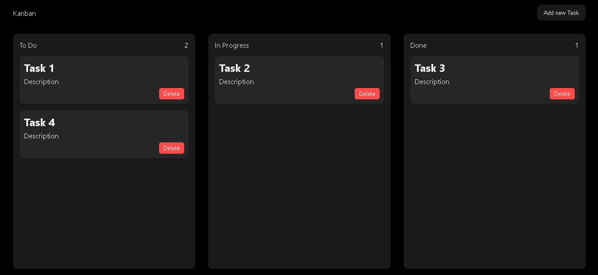
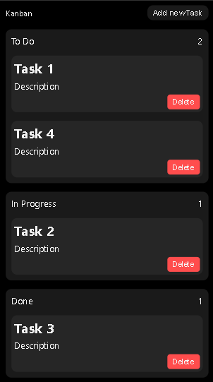

# Kanban Board – Vanilla JavaScript 📝

A clean and minimal **Kanban task manager** built using **HTML, CSS & Vanilla JavaScript** with full drag-and-drop and automatic task saving using `localStorage`.  

This project is great for understanding DOM manipulation, events, and JS drag APIs without using any frameworks.


## 🚀 Live Demo

👉 (Add GitHub Pages link here)


## ✨ Features

✔ Add tasks with title & description  
✔ Drag & Drop between columns  
✔ Delete tasks  
✔ Live task counters  
✔ Saved inside LocalStorage  
✔ Fully responsive  
✔ Smooth mobile UI  


## 🖼 Screenshots

<p align="center">
  
  
</p>


## 📂 Project Structure

```

index.html
style.css
script.js

````


## 🧩 Technologies Used

- HTML5  
- CSS3  
- JavaScript (ES6)  
- LocalStorage  


## 📦 Installation

1. Clone the repo  

```bash
git clone https://github.com/cyberfortify/kanban-board.git
````

2. Open folder

```bash
cd kanban-board
````

3. Open `index.html` in your browser
   (Or use VS Code Live Server extension)


## 🔥 How It Works

* Each column stores its tasks in `localStorage`
* When you drag & drop a task, the state updates automatically
* On reload, tasks are restored exactly where they were

## 📱 Responsive Behavior

* Desktop → 3 columns side-by-side
* Tablet → snap scroll
* Mobile → smooth horizontal scrolling + drag & drop support

## 📌 Future Enhancements

* Task edit modal
* Drag handle icon
* Priority labels
* Deadline feature
* Multiple boards


## 👨‍💻 Author

**Aditya Vishwakarma**
Python & Web Developer

🌐[Portfolio](https://imadityavk.vercel.app/)
💼[LinkedIn](https://linkedin.com/in/imadityavk)
🔗[GitHub](https://github.com/cyberfortify)

## ⭐ If you like this project…

Please give it a ⭐ on GitHub 😄


